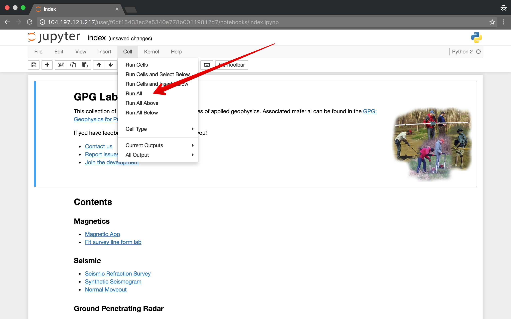
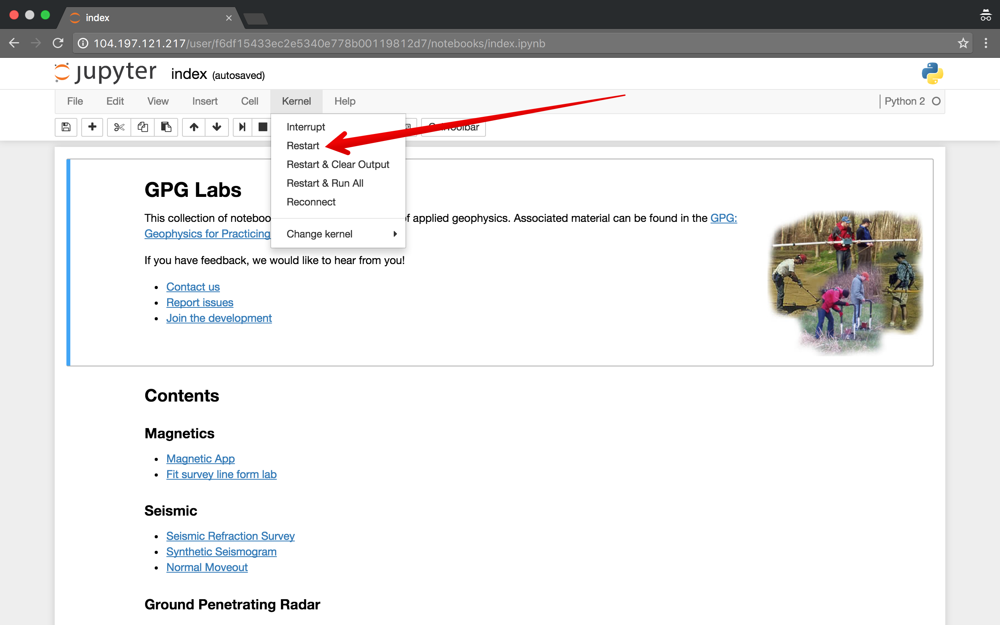
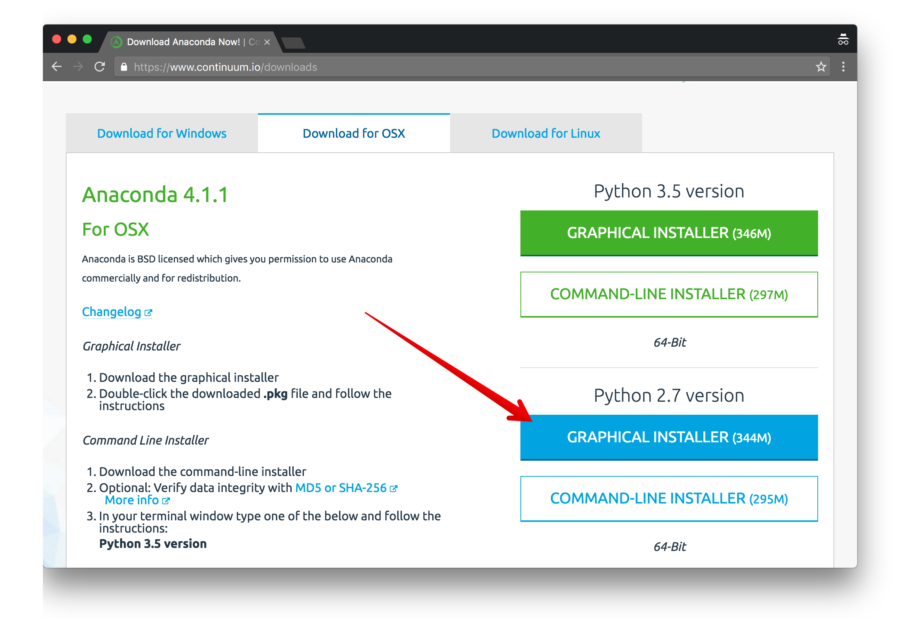
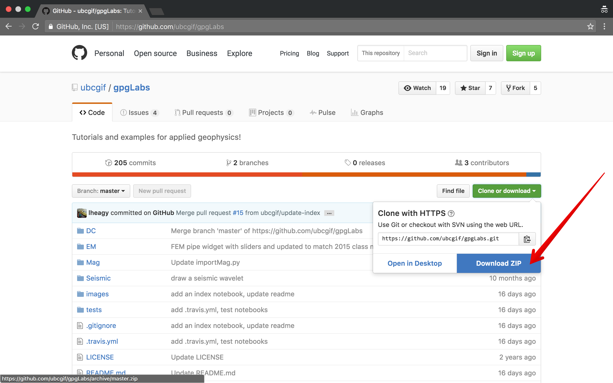
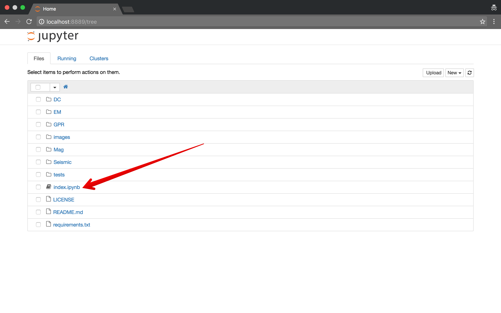

.. _apps:

Apps
====

Jupyter Notebooks for this course are available through the binders service

.. image:: http://mybinder.org/badge.svg
    :target: http://mybinder.org:/repo/ubcgif/gpgLabs
    :align: center

|

or `downloaded here <https://github.com/ubcgif/gpgLabs/archive/master.zip>`_

Each of the apps available for the course are linked and listed in the
notebook. This will be updated during the course.

If you run into issues, you can check the `binder status <http://mybinder.org/status/>`_.

Running the Notebooks
---------------------

Each notebook contains a number of *cells* which contain code that needs to be
executed to run the app. You can do this cell by cell by executing `Shift + Enter`
or by running all of the cells (see image below)

If you run into issues, or want to start from a clean slate, you can use the
keyboard shortcut `Esc + 00` or the Kernel --> restart (see image below) to
restarts the kernel (clears the current variables from memory)

Installing Locally
------------------

Step 1: Download Anaconda
^^^^^^^^^^^^^^^^^^^^^^^^^

If you would like to download and run the notebooks on your own computer, you will need to
first install python. You can do this with `anaconda <https://www.continuum.io/downloads>`_

Before trying to run any of the apps, be sure to quit and re-open a command
window (this refreshes your environment, so it will look at the newly installed python)

Step 2: Download GPG Labs
^^^^^^^^^^^^^^^^^^^^^^^^^

The notebooks can be downloaded from `github <https://github.com/ubcgif/gpgLabs>`_. This will
be updated during the term.

Unpack the zip file somewhere handy.

Step 3: Install Package Dependencies
^^^^^^^^^^^^^^^^^^^^^^^^^^^^^^^^^^^^

To then run the notebooks, you need to open up a command window / terminal in that folder.
Use the command :code:`cd` to change the directory the terminal is in.

You will need to install a few packages. This is done by running::

    pip install -r requirements.txt

If you are run into an error about `git`, `download and install git <https://git-scm.com/downloads>`_.
Then re-run :code:`pip install -r requirements.txt`. This step will only need to be done
the first time you download the zip file.

Step 4: Run the Apps
^^^^^^^^^^^^^^^^^^^^

Once in the `gpgLabs` directory, you can start the apps by running::

    jupyter notebook

from the command line. If you then open the index notebook, this is the
starting point with all other notebooks outlined.

Email the :ref:`TAs <Contact_Info>` if you run into issues!

